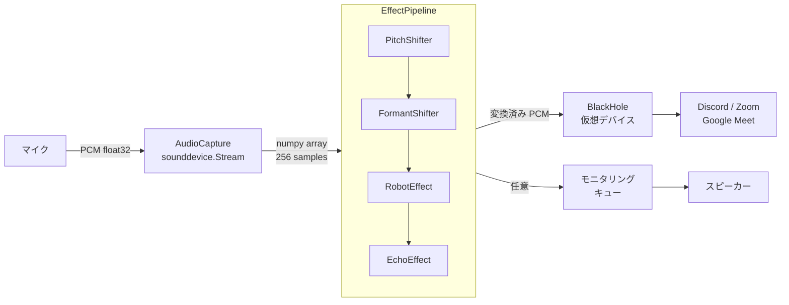
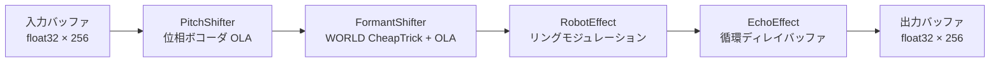
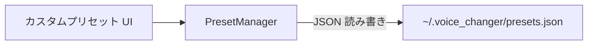
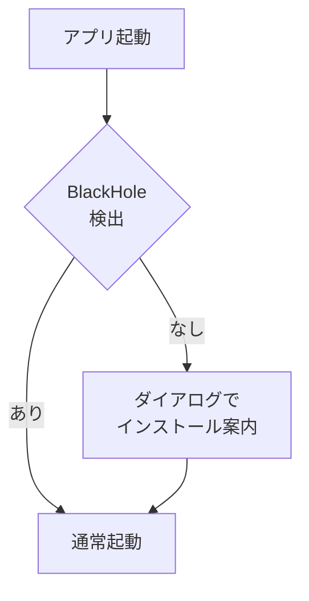

# アーキテクチャ設計

## 技術スタック

| 役割 | 採用技術 | 選定理由 |
|------|---------|---------|
| 言語 | Python 3.11+ | ユーザー習熟度・音声 DSP エコシステムの豊富さ |
| パッケージ管理 | uv | 高速・lockfile 管理 |
| Lint / Format | ruff | uv との親和性 |
| 音声 I/O | sounddevice (PortAudio) | 低レイテンシ・クロスプラットフォーム |
| 数値演算 | numpy | 音声バッファ操作・FFT の基盤 |
| GUI | PySide6 (Qt for Python) | 純 Python・LGPL ライセンス・Mac/Win 対応 |
| 波形描画 | pyqtgraph | Qt ネイティブ・リアルタイム描画に特化 |
| CLI UI | rich | ターミナル UI（`--cli` フラグ時に使用） |
| 設定ファイル | YAML (PyYAML) | 人間・AI ともに読みやすい |
| 仮想オーディオ | BlackHole 2ch | MIT ライセンス・Mac 標準的な選択 |

> **注意:** pyrubberband / pyworld の pyrubberband は Phase 3（ML ベース変換）向けに依存関係として保持しているが、
> 現在の Phase 1/2 エフェクトでは使用していない。ピッチ処理は numpy の位相ボコーダで実装。
> pyworld は FormantShifter の CheapTrick スペクトル包絡推定で使用中。

---

## システム構成



---

## エフェクトパイプライン

各エフェクトは `BaseEffect` を継承した独立モジュールとして実装し、`EffectPipeline` が直列に実行する。



| エフェクト | 手法 | パラメータ |
|-----------|------|-----------|
| PitchShifter | 位相ボコーダ（OLA）| `semitones`: -12〜+12（0.1 刻み） |
| FormantShifter | WORLD CheapTrick 包絡推定 + OLA | `ratio`: 0.5〜2.0（0.01 刻み） |
| RobotEffect | リングモジュレーション | `carrier_freq` (Hz): 20〜500 |
| EchoEffect | 循環ディレイバッファ | `delay_ms`: 50〜1000、`decay`: 0〜0.9 |

### 組み込みプリセット

| プリセット | PitchShifter | FormantShifter | 備考 |
|-----------|-------------|----------------|------|
| 男声 → 女声 (`m2f`) | +5 semitones | ratio: 1.3 | |
| 女声 → 男声 (`f2m`) | -5 semitones | ratio: 0.75 | |
| ギャル声 (`gal`) | +12 semitones | ratio: 1.2 | 1 オクターブ上 + 声道長短縮 |
| ロボット (`robot`) | — | — | carrier_freq: 50 Hz |
| エコー (`echo`) | — | — | delay_ms: 300、decay: 0.4 |

m2f / f2m / gal は相互排他（同時に 1 つだけ有効）。robot / echo は独立して ON/OFF 可能。

---

## DSP 設計

### OLA（Overlap-Add）方式

PitchShifter・FormantShifter は、256 サンプルの入力ブロックを 2048 サンプルの大きな分析フレームに乗せて処理する。
ブロック単位での FFT はブロック境界で位相不連続が生じ、機械的なノイズになる。OLA により複数ブロックを重ね合わせることで位相連続性を保つ。

```
FRAME = 2048  # 分析フレームサイズ
HOP   = 256   # 入力ブロックサイズ（= block_size）
overlap ratio = 1 - HOP/FRAME = 87.5%
OLA 正規化係数 = sum(hann_window²) / HOP ≈ 3.0
```

### PitchShifter: 位相ボコーダ

1. 入力バッファ（FRAME サンプル）に Hann 窓を掛けて FFT
2. `princarg` で位相の主値折り返し → 瞬時周波数を推定
3. bin k → `round(k * alpha)` にスペクトルをマッピング（`alpha = 2^(semitones/12)`）
4. 合成位相を累積して IFFT → Hann 窓 → OLA で出力バッファに加算

ブロックをまたいで `_prev_phase`・`_synth_phase` を保持することで位相の連続性を維持する。

### FormantShifter: WORLD CheapTrick + OLA

従来の生 FFT スペクトル補間では高調波が bin 境界をまたいでエネルギーが分散し、
音量低下と機械的な音質になる問題があった。WORLD の CheapTrick を使って
「声道包絡（フォルマント情報）」だけを正確に抽出・操作することで解決した。

**処理フロー:**

1. 入力バッファに Hann 窓を掛けて FFT → `X[k]`
2. WORLD CheapTrick でスムーズな声道包絡（パワースペクトル）を推定 → `sp[k]`
3. 包絡を周波数軸方向にワープ → `sp_shifted[k] = sp[k / ratio]`
4. FFT スペクトルに包絡比を乗算: `X_shifted[k] = X[k] * sqrt(sp_shifted[k] / sp[k])`
5. IFFT → Hann 窓 → OLA で出力バッファに加算

```python
# 包絡比を乗算することで高調波の位置を保ちながら声道特性（フォルマント）だけを変換
warped = X * sqrt(sp_shifted / sp_orig)
```

**旧手法との違い:**

| | 旧（FFT スペクトル補間） | 新（WORLD CheapTrick） |
|---|---|---|
| 操作対象 | FFT スペクトル全体（高調波ごと移動） | 声道包絡のみ（高調波位置は不変） |
| エネルギー損失 | 高調波が bin 境界をまたいで分散 | 包絡比なので発生しない |
| 音質 | 機械的・音量低下 | 自然な声質を維持 |

**計算コスト最適化:**

WORLD 分析（`dio` + `stonemask` + `cheaptrick`）は毎ホップ実行すると重いため、
4 ホップ（≈23ms）に 1 回だけ更新してキャッシュを使い回す。
声道特性はこの程度の時間スケールでは十分安定しているため音質への影響は無視できる。

```
_ENV_UPDATE_HOPS = 4   # 4 hop ごとに更新
_WORLD_FRAME_PERIOD_MS = 10.0  # WORLD 分析フレーム間隔
speed = 12             # dio の高速モード（精度を少し下げて高速化）
```

---

## GUI 設計

### 画面構成

```
MainWindow (QMainWindow)
├── デバイス設定 (QGroupBox)
│   ├── 入力デバイス選択 (QComboBox)
│   ├── 出力デバイス選択 (QComboBox)
│   ├── モニターデバイス選択 (QComboBox)
│   └── 開始 / 停止ボタン
├── プリセット (QGroupBox)
│   └── 男→女 / 女→男 / ギャル声 / ロボット / エコー (QPushButton × 5, checkable)
├── カスタムプリセット (QGroupBox)
│   ├── プリセット選択 (QComboBox) + 適用 / 削除ボタン
│   └── 名前入力 (QLineEdit) + 新規保存 / 上書き保存ボタン
├── エフェクト (QGroupBox)
│   ├── ピッチ行 (EffectRow)
│   ├── フォルマント行 (EffectRow)
│   ├── ロボット行 (EffectRow)
│   └── エコー行 (EffectRow)
├── 出力設定 (QGroupBox)
│   └── 出力音量スライダー (0〜200%, 5% 刻み)
└── ステータスバー行
    ├── 状態ラベル (停止中 / 変換中)
    ├── 波形表示ボタン → WaveformWindow（別ウィンドウ）
    └── モニタリングトグル (ToggleSwitch)
```

### カスタムウィジェット

| ウィジェット | ファイル | 説明 |
|-------------|---------|------|
| `ToggleSwitch` | `widgets/toggle_switch.py` | アニメーション付きトグルスイッチ（QAbstractButton ベース、QPropertyAnimation） |
| `EffectRow` | `widgets/effect_row.py` | エフェクト名ラベル + ToggleSwitch + QSlider × N のレイアウト行。`ParamSpec` dataclass でパラメータ定義 |

### カスタムプリセット管理



保存データ構造:

```json
{
  "プリセット名": {
    "pitch":   { "enabled": true,  "semitones": 5.0 },
    "formant": { "enabled": true,  "ratio": 1.3 },
    "robot":   { "enabled": false, "carrier_freq": 50.0 },
    "echo":    { "enabled": false, "delay_ms": 300.0, "decay": 0.4 },
    "output_gain": 1.0
  }
}
```

### 波形モニター

変換後の音声をスピーカー等でリアルタイム確認する機能。
音声コールバック（リアルタイムスレッド）をブロックしないよう、キューを介した非同期設計にしている。

```
音声コールバック (RT スレッド)
  ↓ queue.put_nowait()  ← 満杯なら無音でドロップ（キュー上限 16）
  queue.Queue(maxsize=16)
  ↓ QTimer (33ms) が Qt メインスレッドで取り出し
  pyqtgraph PlotWidget（入力: 青 #4FC3F7 / 出力: 緑 #4CAF50）
```

- 表示サンプル数: 4096 samples（約 93ms @ 44100Hz）
- 更新レート: 約 30fps（33ms 間隔）
- 「波形表示」ボタン押下時に別ウィンドウとして表示、閉じれば停止

### モニタリング機能

```
音声コールバック
  ↓ queue.put_nowait()  ← 満杯なら無音でドロップ（レイテンシ優先）
  queue.Queue(maxsize=8)
  ↓ daemon ワーカースレッドが取り出し
  sounddevice.OutputStream（モニタリングデバイス）
```

- `AudioCapture.set_monitor(enabled: bool) -> bool`: 実行時に ON/OFF 切り替え可能
- モニタリングデバイス未設定時は `set_monitor` が `False` を返す

---

## ディレクトリ構成

```
voice_changer/
├── src/
│   └── voice_changer/
│       ├── main.py              # エントリポイント（デフォルト: GUI / --cli: CLI）
│       ├── __main__.py          # python -m voice_changer サポート
│       ├── audio/
│       │   ├── capture.py       # マイク入力・BlackHole 出力・モニタリング
│       │   └── pipeline.py      # エフェクト直列実行
│       ├── effects/
│       │   ├── base.py          # BaseEffect 抽象クラス（enabled フラグ管理）
│       │   ├── pitch.py         # 位相ボコーダ OLA
│       │   ├── formant.py       # WORLD CheapTrick スペクトル包絡 + OLA
│       │   ├── robot.py         # リングモジュレーション
│       │   └── echo.py          # 循環ディレイバッファ
│       ├── gui/
│       │   ├── app.py           # QApplication エントリポイント・ダークテーマ stylesheet
│       │   ├── main_window.py   # QMainWindow（デバイス選択・プリセット・エフェクト制御）
│       │   ├── preset_manager.py # カスタムプリセット保存・読み込み・削除
│       │   ├── waveform_window.py # リアルタイム波形表示（pyqtgraph）
│       │   └── widgets/
│       │       ├── toggle_switch.py  # アニメーション付きトグルスイッチ
│       │       └── effect_row.py     # エフェクト行（トグル + スライダー）
│       ├── setup/
│       │   └── blackhole.py     # BlackHole 検出・インストール支援
│       └── cli/
│           └── app.py           # rich による CLI UI（--cli フラグ時に使用）
├── config/
│   └── default.yaml             # デフォルト設定（sample_rate, block_size）・プリセット定義
├── docs/
│   ├── requirements.md
│   └── architecture.md
├── tests/
│   └── test_effects.py
├── pyproject.toml
├── README.md
└── CLAUDE.md
```

---

## 処理フローとレイテンシ

```
マイク入力
  ↓  [≈ 5.8ms]  バッファ蓄積 (256 samples @ 44100Hz)
AudioCapture コールバック
  ↓  [≈ 40.6ms] OLA ウォームアップ (FRAME - HOP = 1792 samples)
EffectPipeline（PitchShifter + FormantShifter + RobotEffect + EchoEffect）
  ↓  [≈ 0.5ms]  出力バッファ書き込み
BlackHole 出力
  ↓
Discord / Zoom

合計: ≈ 47ms（目標 50ms 以内）
```

> OLA ウォームアップは PitchShifter/FormantShifter が有効な場合のみ発生する。
> ロボット・エコーのみ使用する場合は ≈ 6ms。

---

## BlackHole セットアップフロー



---

## 開発フェーズ

| Phase | 内容 | 状態 |
|-------|------|------|
| **Phase 1** | DSP ベースエフェクト（OLA 位相ボコーダ / WORLD CheapTrick）・CLI UI・BlackHole セットアップフロー | ✅ 完了 |
| **Phase 2** | デスクトップ GUI（PySide6）・カスタムプリセット管理・波形モニター・ギャル声プリセット | ✅ 完了 |
| **Phase 3** | ML ベース変換（RVC / WORLD Vocoder）・Windows 対応 | 未着手 |
