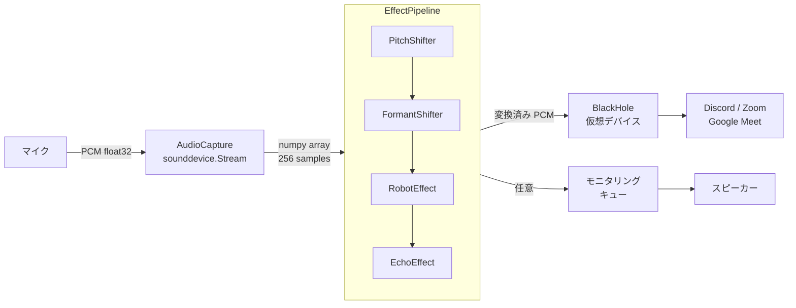
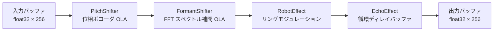
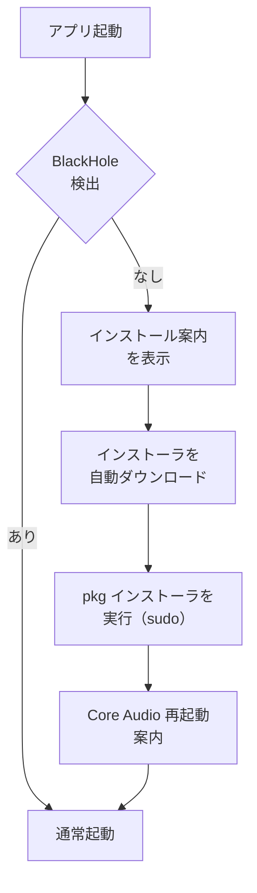

# アーキテクチャ設計

## 技術スタック

| 役割 | 採用技術 | 選定理由 |
|------|---------|---------|
| 言語 | Python 3.11+ | ユーザー習熟度・音声 DSP エコシステムの豊富さ |
| パッケージ管理 | uv | 高速・lockfile 管理 |
| Lint / Format | ruff | uv との親和性 |
| 音声 I/O | sounddevice (PortAudio) | 低レイテンシ・クロスプラットフォーム |
| 数値演算 | numpy | 音声バッファ操作・FFT の基盤 |
| CLI UI | rich | ターミナル UI の視認性向上 |
| 設定ファイル | YAML (PyYAML) | 人間・AI ともに読みやすい |
| 仮想オーディオ | BlackHole 2ch | MIT ライセンス・Mac 標準的な選択 |

> **注意:** pyrubberband / pyworld は Phase 3（ML ベース変換）向けに依存関係として保持しているが、
> 現在の Phase 1 エフェクトでは使用していない。ピッチ・フォルマント処理は numpy のみで実装。

---

## システム構成



---

## エフェクトパイプライン

各エフェクトは `BaseEffect` を継承した独立モジュールとして実装し、`EffectPipeline` が直列に実行する。



| エフェクト | 手法 | パラメータ |
|-----------|------|-----------|
| PitchShifter | 位相ボコーダ（OLA）| `semitones`: -12〜+12 |
| FormantShifter | FFT スペクトル補間（OLA）+ A特性補正 | `ratio`: 0.5〜2.0 |
| RobotEffect | リングモジュレーション | `carrier_freq` (Hz) |
| EchoEffect | 循環ディレイバッファ | `delay_ms`, `decay` |

### プリセット（`config/default.yaml` に定義）

| プリセット | PitchShifter | FormantShifter |
|-----------|-------------|----------------|
| 男声 → 女声 (`m2f`) | +5 semitones | ratio: 1.3 |
| 女声 → 男声 (`f2m`) | -5 semitones | ratio: 0.75 |

---

## DSP 設計

### OLA（Overlap-Add）方式

PitchShifter・FormantShifter は、256 サンプルの入力ブロックを 2048 サンプルの大きな分析フレームに乗せて処理する。
ブロック単位での FFT はブロック境界で位相不連続が生じ、機械的なノイズになる。OLA により複数ブロックを重ね合わせることで位相連続性を保つ。

```
FRAME = 2048  # 分析フレームサイズ
HOP   = 256   # 入力ブロックサイズ（= block_size）
overlap ratio = 1 - HOP/FRAME = 87.5%
OLA 正規化係数 = sum(hann_window²) / HOP ≈ 3.0
```

### PitchShifter: 位相ボコーダ

1. 入力バッファ（FRAME サンプル）に Hann 窓を掛けて FFT
2. `princarg` で位相の主値折り返し → 瞬時周波数を推定
3. bin k → `round(k * alpha)` にスペクトルをマッピング（`alpha = 2^(semitones/12)`）
4. 合成位相を累積して IFFT → Hann 窓 → OLA で出力バッファに加算

ブロックをまたいで `_prev_phase`・`_synth_phase` を保持することで位相の連続性を維持する。

### FormantShifter: FFT スペクトル補間

1. 入力バッファに Hann 窓を掛けて FFT → `X[k]`
2. スペクトル補間: `warped[k] = X[k / ratio]`（`np.interp` で実部・虚部を別々に補間）
3. A特性重みによる知覚音量補正（下記参照）
4. IFFT → Hann 窓 → OLA で出力バッファに加算

`ratio > 1.0` で低域スペクトルを高域にマッピング → フォルマント周波数上昇 → 女声方向。

### A特性による知覚音量補正

スペクトル補間はハーモニクスを bin 境界にまたがって分散させ、エネルギー損失が生じる。
単純な RMS 正規化では人間の聴覚感度の周波数特性（等ラウドネス曲線）を考慮できず、
ratio が大きいほど音が小さく聞こえる問題があった。

A特性フィルタ（ISO 226）で各 bin を重み付けした知覚エネルギーを入出力で揃えることで解決した。

```python
# A(f) = 12194² * f⁴ / ((f²+20.6²) * sqrt((f²+107.7²)(f²+737.9²)) * (f²+12194²))
# 1kHz 基準で正規化（1kHz = 1.0）
a_weights = _calc_a_weights(n_bins, sample_rate, FRAME)  # __init__ で事前計算

l_in  = dot(|X|      * a_weights, |X|      * a_weights)
l_out = dot(|warped| * a_weights, |warped| * a_weights)
warped *= sqrt(l_in / l_out)
```

---

## モニタリング機能

変換後の音声をスピーカー等でリアルタイム確認する機能。
音声コールバック（リアルタイムスレッド）をブロックしないよう、キューを介した非同期設計にしている。

```
音声コールバック
  ↓ queue.put_nowait()  ← 満杯なら無音でドロップ（レイテンシ優先）
  queue.Queue(maxsize=8)
  ↓ daemon ワーカースレッドが取り出し
  sounddevice.OutputStream（モニタリングデバイス）
```

- `AudioCapture.set_monitor(enabled: bool) -> bool`: 実行時に ON/OFF 切り替え可能
- モニタリングデバイス未設定時は `set_monitor` が `False` を返す

---

## ディレクトリ構成

```
voice_changer/
├── src/
│   └── voice_changer/
│       ├── main.py              # エントリポイント・起動フロー
│       ├── audio/
│       │   ├── capture.py       # マイク入力・BlackHole 出力・モニタリング
│       │   └── pipeline.py      # エフェクト直列実行
│       ├── effects/
│       │   ├── base.py          # BaseEffect 抽象クラス（enabled フラグ管理）
│       │   ├── pitch.py         # 位相ボコーダ OLA
│       │   ├── formant.py       # FFT スペクトル補間 + A特性補正
│       │   ├── robot.py         # リングモジュレーション
│       │   └── echo.py          # 循環ディレイバッファ
│       ├── setup/
│       │   └── blackhole.py     # BlackHole 検出・インストール支援
│       └── cli/
│           └── app.py           # rich による CLI UI・コマンドループ
├── config/
│   └── default.yaml             # デフォルト設定（sample_rate, block_size）・プリセット定義
├── docs/
│   ├── requirements.md
│   └── architecture.md
├── tests/
│   └── test_effects.py
├── pyproject.toml
└── CLAUDE.md
```

---

## 処理フローとレイテンシ

```
マイク入力
  ↓  [≈ 5.8ms]  バッファ蓄積 (256 samples @ 44100Hz)
AudioCapture コールバック
  ↓  [≈ 40.6ms] OLA ウォームアップ (FRAME - HOP = 1792 samples)
EffectPipeline（PitchShifter + FormantShifter + RobotEffect + EchoEffect）
  ↓  [≈ 0.5ms]  出力バッファ書き込み
BlackHole 出力
  ↓
Discord / Zoom

合計: ≈ 47ms（目標 50ms 以内）
```

> OLA ウォームアップは PitchShifter/FormantShifter が有効な場合のみ発生する。
> ロボット・エコーのみ使用する場合は ≈ 6ms。

---

## BlackHole セットアップフロー



---

## 開発フェーズ

| Phase | 内容 |
|-------|------|
| **Phase 1（現在）** | DSP ベースエフェクト（OLA 位相ボコーダ / スペクトル補間）・CLI UI・BlackHole セットアップフロー |
| **Phase 2** | デスクトップ GUI（Tauri または PyQt）・Windows 対応 |
| **Phase 3** | ML ベース変換（RVC / WORLD Vocoder）の追加 |
